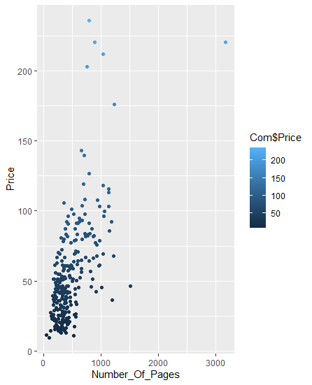
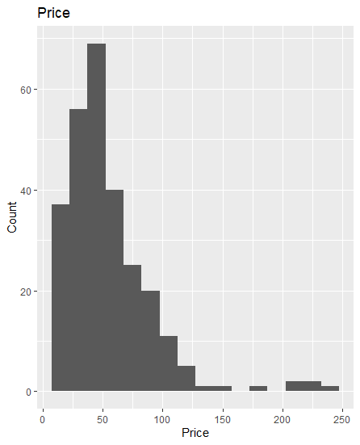

# R-Assignment 4

**Created by กรวิชญ์ วัฒนธนกุล (ID: 63130500001)**

Choose Dataset:
1. Top 270 Computer Science / Programing Books (Data from Thomas Konstantin, [Kaggle](https://www.kaggle.com/thomaskonstantin/top-270-rated-computer-science-programing-books)) >> [Using CSV](https://raw.githubusercontent.com/safesit23/INT214-Statistics/main/datasets/prog_book.csv)

### Outlines
1. Explore the dataset
2. Learning function from Tidyverse
3. Transform data with dplyr and finding insight the data
4. Visualization with GGplot2

## Part 1: Explore the dataset

```
# Library
library("tidyverse")
library("dplyr")
library("ggplot2")
library('assertive')
library("readr")
library("stringr")
library("tibble")

# Dataset
Com <- read.csv("https://raw.githubusercontent.com/safesit23/INT214-Statistics/main/datasets/prog_book.csv")
```

### see Dataset
View(Com)
### check datatype
Com$Rating %>% is.numeric()
Com$Number_Of_Pages %>% is.numeric()
Com$Book_title %>% is.character()
### check number of row and column in dataset
Com %>% glimpse()


## Part 2: Learning function from Tidyverse

- Function `tibble()` from package [tibble](https://tibble.tidyverse.org/). It using for create table

```
tibble(x =0:10 , y = -(x^2) , z =x+y)
```
** You can sepearate this part or combine in part of `Transform data with dplyr and finding insight the data`

## Part 3: Transform data with dplyr and finding insight the data

### 3.1 find average of Rating of this Dataset

```
Com$Rating %>% mean(.,na.rm=T)
```

Result:

```
[1] 4.067417
```
Rating has average 4.067417

### 3.2 find the max Reviews of this Dateset
```
Com$Reviews %>% str_remove(",") %>% as.numeric() %>% max(.,na.rm = T)
```

Result:

```
[1] 5938
```
Max reviews is 5938

### 3.3 check type of the book that has more than 1000 pages in this Dataset
```
Com %>% filter(Number_Of_Pages > 1000) %>% select(Type,Number_Of_Pages)
```

Result:
```
        Type Number_Of_Pages
1  Paperback            1200
2  Paperback            1008
3  Hardcover            1506
4  Paperback            1214
5  Hardcover            1040
6  Hardcover            1142
7  Hardcover            1180
8  Hardcover            1052
9  Hardcover            1056
10 Paperback            1136
11 Hardcover            1136
12 Hardcover            1132
13 Hardcover            1040
14 Hardcover            1235
15 Paperback            1040
16 Hardcover            3168
```
Book types have Paperback,Hardcover then it has pages more than 1000 pages


## Part 4: Visualization with GGplot2
### 4.1 plot graph show relation between Price and Number of Pages
```
Com %>% ggplot(aes(x=Number_Of_Pages,y=Price))+geom_point(aes(color=Com$Price))
```
Result:



### 4.2 plot graph histogram show Price
```
Com %>% ggplot(aes(x=Price))+geom_histogram(binwidth = 15)+ggtitle("Price")+xlab("Price")+ylab("Count")
```
Result:


**Guideline:
Embed Image by using this syntax in markdown file
````

````
