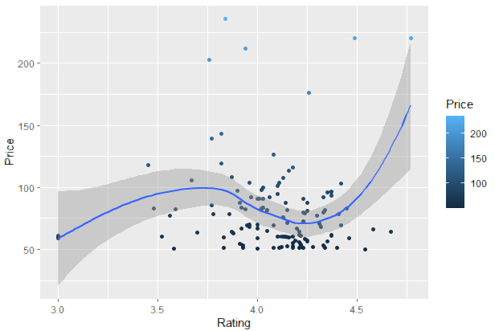

# R-Assignment 4

**Created by Name-Surname (ID: xxxxxxxxxx)**

Choose Dataset:
1. Top 270 Computer Science / Programing Books (Data from Thomas Konstantin, [Kaggle](https://www.kaggle.com/thomaskonstantin/top-270-rated-computer-science-programing-books)) >> [Using CSV](https://raw.githubusercontent.com/safesit23/INT214-Statistics/main/datasets/prog_book.csv)

2. Superstore Sales Dataset (Data from Rohit Sahoo,[Kaggle](https://www.kaggle.com/rohitsahoo/sales-forecasting)) >> [Using CSV](https://raw.githubusercontent.com/safesit23/INT214-Statistics/main/datasets/superstore_sales.csv)


### Outlines
1. Explore the dataset
2. Learning function from Tidyverse
3. Transform data with dplyr and finding insight the data
4. Visualization with GGplot2

## Part 1: Explore the dataset

```
# Library
library(dplyr)
library(assertive)
library(stringr)
library(ggplot2)

# Dataset
dataset <- read_csv("https://raw.githubusercontent.com/safesit23/INT214-Statistics/main/datasets/prog_book.csv")
```

In this dataset has Top 270 Computer Science / Programing Books


## Part 2: Learning function from Tidyverse

- Function `select()` from package [dplyr](https://dplyr.tidyverse.org/articles/dplyr.html#select-columns-with-select)). It using for select columns

```
starwars %>% select(name,height)
```
** You can sepearate this part or combine in part of `Transform data with dplyr and finding insight the data`

## Part 3: Transform data with dplyr and finding insight the data

3.1 Show the top 10 books according to the book rating.

```
data  %>% select(Rating,Book_title,Price) %>% arrange(Rating) %>% head(10)
```

Result:

```
 Rating                                                                                                                           Book_title     Price
1    3.00                                                                                  Advanced Game Programming: A Gamedev.Net Collection  59.08235
2    3.00                                            Cross-Platform Game Programming (Game Development) (Charles River Media Game Development)  60.39118
3    3.00                                                                              Lambda-Calculus, Combinators and Functional Programming  61.16765
4    3.20                                                                                                        Game Programming Golden Rules  19.15294
5    3.22                                                                                                                     Beginning Java 2  36.61765
6    3.32                                                                                           Sams Teach Yourself JavaScript in 24 Hours  27.85000
7    3.33                                                                                         Responsive Web Design Overview For Beginners  11.26765
8    3.37                                                                                                       Unity Virtual Reality Projects  45.66471
9    3.38                                                                                                 Sams Teach Yourself Perl in 24 Hours  38.23529
10   3.45 3D Game Engine Design: A Practical Approach to Real-Time Computer Graphics (The Morgan Kaufmann Series in Interactive 3D Technology) 117.98824
 
```
top 10 books according to the book rating


3.2 Books rated between 4-5 What books are there?

```
library(assertive)
is.numeric(data$Rating)
data %>% filter(Rating>4.5 , Rating <5) %>% select(Book_title,Rating)
```

Result:

```
1                                          ZX Spectrum Games Code Club: Twenty fun games to code and learn   4.62
2                      The Elements of Computing Systems: Building a Modern Computer from First Principles   4.54
3              Build Web Applications with Java: Learn every aspect to build web applications from scratch   4.67
4 Designing Data-Intensive Applications: The Big Ideas Behind Reliable, Scalable, and Maintainable Systems   4.72
5                            The Linux Programming Interface: A Linux and Unix System Programming Handbook   4.62
6                                                                 Practical Object Oriented Design in Ruby   4.54
7                                                 Fluent Python: Clear, Concise, and Effective Programming   4.67
8                                                                         CLR via C# (Developer Reference)   4.58
9                                                  The Art of Computer Programming, Volumes 1-4a Boxed Set   4.77
  
```
Books rated between 4-5


3.3 Average rating of all books

```
is.numeric(data$Rating)
data %>% summarise(Average = mean(Rating))
```

Result:

```
 Average
1 4.067417
  
```
Average rating of all books is 4.067417


3.4 Shows the price of a book by showing the max, min, and average price.

```
is.numeric(data$Price)
data %>% summarise(Max = max(Price)) 
data %>% summarise(Min = min(Price)) 
data %>% summarise(Average = mean(Price))
```

Result:

```
     Max
1 235.65
       Min
1 9.323529
   Average
1 54.54186
  
```
Max price is 235.65
Min price is 9.323529
Aeverage is 54.54186


3.5 Displays information on Kindle Edition book types with prices over 20.

```
data  %>% filter(data$Type == "Kindle Edition"& Price <20.0) %>% glimpse()
```

Result:

```
Rows: 2
Columns: 7
$ Rating          <dbl> 3.33, 4.06
$ Reviews         <chr> "0", "1,325"
$ Book_title      <chr> "Responsive Web Design Overview For Beginners", "How Google Works"
$ Description     <chr> "In Responsive Web Design Overview For Beginners, you'll get an overview of what to expect w~
$ Number_Of_Pages <int> 50, 305
$ Type            <chr> "Kindle Edition", "Kindle Edition"
$ Price           <dbl> 11.26765, 13.16471

  
```
Kindle Edition book types with prices over 20.


3.6 Most reviewed book titles

```
is.numeric(data$Reviews) #[1] FALSE
review_score <- data$Reviews %>% str_remove(",") %>% str_trim() %>% as.numeric()
is.numeric(review_score)
review_score %>% max() 
```

Result:

```
[1] 5938

  
```
Most reviewed book titles is 5938 (book title is  Start with Why: How Great Leaders Inspire Everyone to Take Action)


## Part 4: Visualization with GGplot2
### 1.) Graph shows  between Rating and Price
```
point <- data  %>% filter(Price >50)%>% ggplot(aes(x=Rating,y=Price))+geom_point(aes(color= Price ))+geom_smooth()

point
```
Result:



**Guideline:
Embed Image by using this syntax in markdown file
````

````
