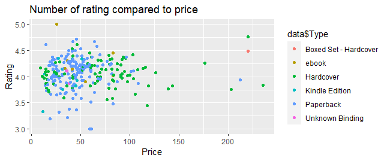
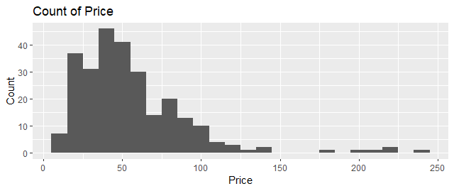

# R-Assignment 4

**Created by Chotiwit Souyan (ID: 63130500026)**

Choosen Dataset:
**Top 270 Computer Science / Programing Books** (Data from Thomas Konstantin, [Kaggle](https://www.kaggle.com/thomaskonstantin/top-270-rated-computer-science-programing-books)) >> [Using CSV](https://raw.githubusercontent.com/safesit23/INT214-Statistics/main/datasets/prog_book.csv)


### Outlines
1. Explore the dataset
2. Learning function from Tidyverse
3. Transform data with dplyr and finding insight the data
4. Visualization with GGplot2

## Part 1: Explore the dataset

```
# Library
library(tidyverse)

# Dataset
data <- read_csv("https://raw.githubusercontent.com/safesit23/INT214-Statistics/main/datasets/prog_book.csv")
```

## Part 2: Learning function from Tidyverse

- Function `as_tibble()` from package [tibble](https://dplyr.tidyverse.org/articles/dplyr.html#select-columns-with-select)). It using for create a tibble from an existing object

```
data %>% as_tibble()starwars %>% select(name,height)
```


## Part 3: Transform data with dplyr and finding insight the data

### 3.1 How many data in this dataset 

Use glimpse() to display infoemation

```
data %>% glimpse()
```

```
Rows: 271
Columns: 7
$ Rating          <dbl> 4.17, 4.01, 3~
$ Reviews         <dbl> 3829, 1406, 0~
$ Book_title      <chr> "The Elements~
$ Description     <chr> "This style m~
$ Number_Of_Pages <dbl> 105, 527, 50,~
$ Type            <chr> "Hardcover", ~
$ Price           <dbl> 9.323529, 11.~
```

There are 271 observations and 7 variables.

### 3.2 Find max, min, average of Rating

Use max() min() and mean().

```
data$Rating %>% max()
data$Rating %>% min()
data$Rating %>% mean()
```

Result:

```
> data$Rating %>% max()
[1] 5
> data$Rating %>% min()
[1] 3
> data$Rating %>% mean()
[1] 4.067417
```
The highest rating is 5.
The lowest rating is 3.
An average rating is 4.07.

### 3.3 Find max, min, average of Reviews

Use max() min() and mean().

```
data$Reviews %>% max()
data$Reviews %>% min()
data$Reviews %>% mean()
```

Result:

```
> data$Reviews %>% max()
[1] 5938
> data$Reviews %>% min()
[1] 0
> data$Reviews %>% mean()
[1] 185.5572
```

The highest reviews is 5938.
The lowest reviews is 0.
An average reviews is 185.56.

### 3.4 How many types in this dataset

Use as.factor() to change type of Typy to factor and then use glimpse() to see how many type are in this dataset.

```
data$Type %>% as.factor() %>% glimpse()
```

Result:

```
 Factor w/ 6 levels "Boxed Set - Hardcover",..: 3 3 4 3 4 5 3 3 3 5 ...
```

There are 6 types in this dataset.

### 3.5 List a book that has price greater than 200 

Use filter() to filter a proce that greater than 200 and then use glimpse() to display information.

```
data %>% filter(Price > 200) %>% glimpse()
```

Result:

```
Rows: 5
Columns: 7
$ Rating          <dbl> 3.76, 3.94, 4~
$ Reviews         <dbl> 0, 22, 36, 4,~
$ Book_title      <chr> "3D Game Engi~
$ Description     <chr> "Dave Eberly'~
$ Number_Of_Pages <dbl> 752, 1040, 89~
$ Type            <chr> "Hardcover", ~
$ Price           <dbl> 203.1088, 212~
```

There are 5 books which its price is greater than 200.

## Part 4: Visualization with GGplot2
### 1.) Graph shows relation between Rating and Price

```
rating_plot <- ggplot(data,aes(x=Price,y=Rating)) + geom_point()
rating_plot + ggtitle("Number of rating compared to price") + geom_point(aes(color = data$Type))
```
Result:




### 2.) Graph shows relation between Price and Frequency

```
review_plot <- data %>% filter(Reviews < 2000) %>% ggplot(aes(x=Price)) + geom_histogram(binwidth = 10, bins = 10)
review_plot + ggtitle("Count of Price ") + ylab("Count")
```

Result:

