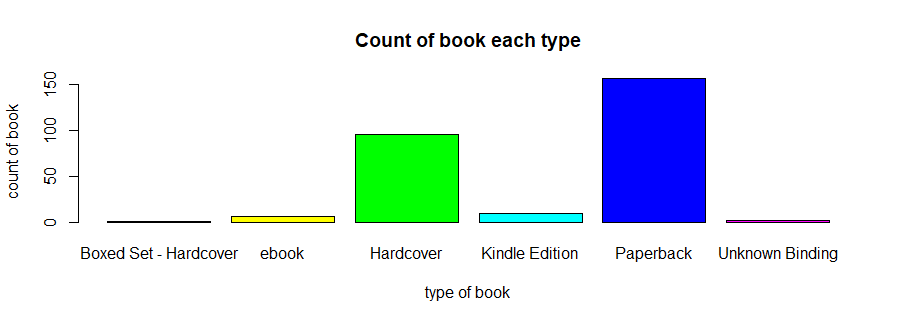
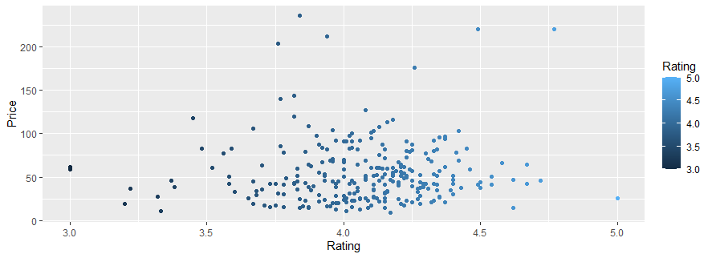

# R-Assignment 4

**Created by Natasia Yusuwapan (ID: 63130500070)**


:avocado:  Choose Dataset : Top 270 Computer Science / Programing Books (Data from Thomas Konstantin, [Kaggle](https://www.kaggle.com/thomaskonstantin/top-270-rated-computer-science-programing-books)) >> [Using CSV](https://raw.githubusercontent.com/safesit23/INT214-Statistics/main/datasets/prog_book.csv)


### 	:mushroom: Outlines :mushroom:
1. Explore the dataset
2. Learning function from Tidyverse
3. Transform data with dplyr and finding insight the data
4. Visualization with GGplot2

## 	:evergreen_tree: Part 1: Explore the dataset

```
#install.packages
install.packages("tidyverse")
library(tidyverse)
library(ggplot2)

# Dataset
dataset <- read_csv("https://raw.githubusercontent.com/safesit23/INT214-Statistics/main/datasets/prog_book.csv")
View(dataset)
```

In this dataset has .....


## :evergreen_tree: Part 2: Learning function from Tidyverse

- Function `select()` from package [dplyr](https://dplyr.tidyverse.org/articles/dplyr.html#select-columns-with-select)). It using for select columns

```
starwars %>% select(name,height)
```
** You can sepearate this part or combine in part of `Transform data with dplyr and finding insight the data`

## :evergreen_tree: Part 3: Transform data with dplyr and finding insight the data

- transform data with dplyr and finding insight the data at least 6 issues. Show your code, result and summary in form of sentence/paragraphs.


```
library(dplyr)
```
### :seedling: 3.1 How many observation of this dataset  ?

Use glimpse() to display infoemation

```
glimpse(dataset)
```
:fallen_leaf:Result
```
Rows: 271
Columns: 7
$ Rating          <dbl> 4.17, 4.01, 3.33, 3.97, 4.06, 3.84, 4.09, 4.15~
$ Reviews         <dbl> 3829, 1406, 0, 1658, 1325, 117, 5938, 1817, 20~
$ Book_title      <chr> "The Elements of Style", "The Information: A H~
$ Description     <chr> "This style manual offers practical advice on ~
$ Number_Of_Pages <dbl> 105, 527, 50, 393, 305, 288, 256, 368, 259, 12~
$ Type            <chr> "Hardcover", "Hardcover", "Kindle Edition", "H~
$ Price           <dbl> 9.323529, 11.000000, 11.267647, 12.873529, 13.~
```

There are 271 observations and 7 variables.

### :seedling: 3.2 Are there duplicate data sets ? (If have duplicate data, list the data that duplicate)  ?
```
dataset %>% duplicated() %>% table()
```
:fallen_leaf:Result
```
FALSE 
  271
```

No duplicate information.


### :seedling: 3.3 hat is min, max, average in price dataset ? 
```
dataset %>% summarise(mean = mean(Price))
dataset %>% summarise(max = max(Price))
dataset %>% summarise(min = min(Price))
```
:fallen_leaf:Result
```
mean
  <dbl>
1  54.5
max
  <dbl>
1  236.
min
  <dbl>
1  9.32
```

The average price is 54.5

The maximum price is 236

The minimum price is 9.32


### :seedling: 3.4 List  the book that has type "ebook"  ?
```
dataset %>% filter(Type == "ebook")
```
:fallen_leaf:Result
```
  Rating Reviews Book_title   Description    Number_Of_Pages Type  Price
   <dbl>   <dbl> <chr>        <chr>                    <dbl> <chr> <dbl>
1   5          0 Your First ~ "A tutorial f~             317 ebook  25.9
2   4.16      33 Algorithms ~ "For anyone w~             237 ebook  34.4
3   4.31     161 Learn You a~ "Learn You a ~             176 ebook  36.7
4   4.15      18 From Mathem~ "In this subs~             320 ebook  41.4
5   3.91      57 Effective P~ "Jeff Atwood ~             283 ebook  54.7
6   4.45      88 Deep Learni~ "An introduct~             787 ebook  83.2
7   4.02       3 Practical F~ "Ebook is fre~             582 ebook  83.2
```
There are 7 the book that has type "ebook" in this dataset.


### :seedling: 3.5 List the book has rating equal to 5  ?
```
dataset %>% duplicated() %>% table()
```
:fallen_leaf:Result
```
  Rating Reviews Book_title  Description     Number_Of_Pages Type  Price
   <dbl>   <dbl> <chr>       <chr>                     <dbl> <chr> <dbl>
1      5       0 Your First~ "A tutorial fo~             317 ebook  25.9

```
There is 1 the book that has rating equal to 5 in this dataset.


### :seedling: 3.6 List the book shows only Hardcover type and has  Number_Of_Pages more than 1000 ?
```
dataset %>% filter(Type == "Hardcover" & Number_Of_Pages > 1000)
```
:fallen_leaf:Result
```
  Rating Reviews Book_title   Description   Number_Of_Pages Type  Price
    <dbl>   <dbl> <chr>        <chr>                   <dbl> <chr> <dbl>
 1   4.62      28 The Linux P~ "The Linux P~            1506 Hard~  46.4
 2   4.08      92 The C++ Pro~ "More than t~            1040 Hard~  69.4
 3   3.77      28 Database Sy~ "Intended fo~            1142 Hard~  85.6
 4   4.33     194 Introductio~ "This title ~            1180 Hard~  92.3
 5   4.35      21 Game Engine~ "Hailed as a~            1052 Hard~  96.0
 6   4.03       1 Geometric T~ "Do you spen~            1056 Hard~  99.8
 7   4.16      16 The C++ Sta~ "The Best-Se~            1136 Hard~ 113. 
 8   4.18     130 Artificial ~ "For one or ~            1132 Hard~ 116. 
 9   3.45       1 3D Game Eng~ "A major rev~            1040 Hard~ 118. 
10   4.26       5 Numerical R~ "Co-authored~            1235 Hard~ 176. 
11   4.77       4 The Art of ~ "\"The bible~            3168 Hard~ 220.
```
There are 11 the book that shows only Hardcover type and has  Number_Of_Pages more than 1000 .


##  :evergreen_tree: Part 4: Visualization with GGplot2
### :seedling: 4.1Graph shows how many each type books  ?
```
counts <- table(dataset$Type)
barplot(counts, main="Count of book each type", 
        xlab="type of book",ylab = "count of book",col = rainbow(6))
```
:fallen_leaf:Result



From the graph, it can be seen that the paperback format books are the most common and are in chronological order.

### :seedling: 4.2 Graph shows  between Rating and Price  ?
```
dataset %>% ggplot(aes(x = Rating,y = Price,color=Rating))  + geom_point()
```
:fallen_leaf:Result



From the graph, shows the data between the price and the rating.

**Guideline:
Embed Image by using this syntax in markdown file
````

````
